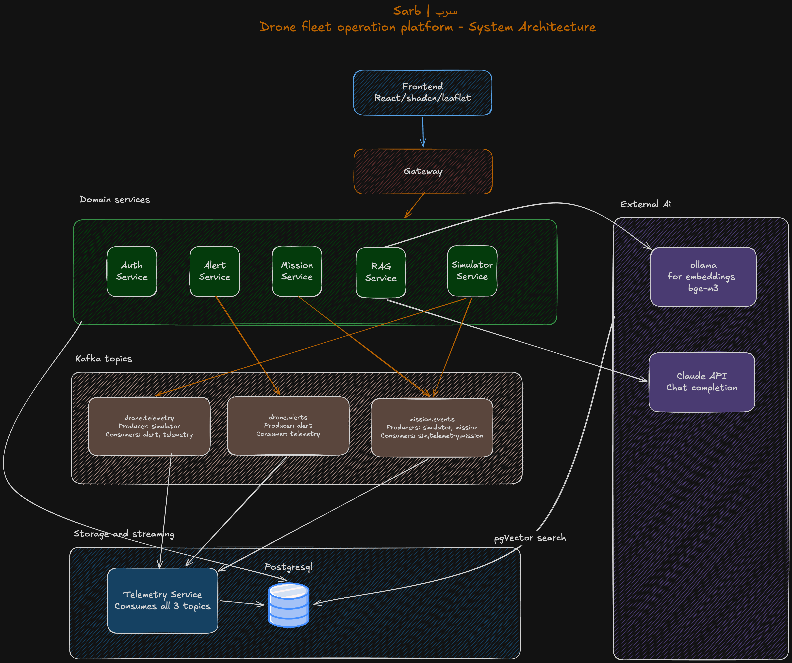
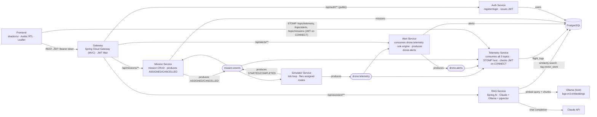

# Sarb (سرب)

**Sarb** — Arabic for "flock/swarm" — is a drone fleet operations platform: a
portfolio project simulating the ground-control backbone an operations team
would use to monitor a fleet of drones in real time, assign missions, raise
alerts, and answer regulatory questions with a RAG assistant. There is no real
drone hardware — a simulator service generates realistic telemetry, exactly as
this kind of software is developed and tested in industry.

The UI is **Arabic, RTL-first** (`dir="rtl" lang="ar"`); code, APIs, Kafka
topics, JSON fields, and enum codes stay English, with the frontend mapping
codes to Arabic labels.

See [`drone-fleet-platform-brief.md`](./drone-fleet-platform-brief.md) for the
full design brief (goals, architecture, settled decisions, build phases) and
[`docs/architecture.md`](./docs/architecture.md) for diagrams and conventions.

## Status

Built incrementally, phase by phase (see brief Section 17 for the full
checklist). **Phases 0–6 are done**: live simulator + map, persistence +
alert rules, Kafka fan-out, missions, a RAG regulatory assistant, and — as of
Phase 6 — JWT auth, an API gateway in front of everything, and a single
`docker compose up` that brings the whole stack up together. Phase 7
(replay, analytics, deconfliction, NL telemetry queries) is optional stretch
and not started.

## Why Kafka?

The simulator publishes each drone's telemetry to a single Kafka topic
(`drone.telemetry`). Two independent consumer groups subscribe to that one
stream and do their own job without knowing about each other:
`telemetry-service` (pushes each frame to the browser over WebSocket *and*
writes a flight-log row) and `alert-service` (runs geofence/battery/signal
rules and produces `drone.alerts`, which `telemetry-service` also relays to
the browser). That fan-out — one producer, multiple decoupled consumers,
each able to fail/retry/scale independently — is the core architectural
story of this project. It arrived in Phase 3; Phase 1 talked to the browser
directly to get the visible demo working fast, before Kafka was introduced.

## Architecture at a glance



<details>
<summary>Same diagram as Mermaid (renders inline on GitHub, stays text-diffable)</summary>



</details>

Same diagram, with more prose, lives in [`docs/architecture.md`](./docs/architecture.md).

## Repo layout

```
Sarb/
├── docker-compose.yml       # Postgres+pgvector, Kafka (KRaft), kafka-ui, and all 7 services + frontend
├── drone-fleet-platform-brief.md  # full design brief - goals, decisions, phase-by-phase build log
├── gateway/                 # Spring Cloud Gateway (MVC) - JWT-gated routing to every backend
├── auth-service/            # Hand-rolled JWT auth (register/login, BCrypt, Postgres schema `auth`)
├── simulator-service/       # N virtual drones, tick loop, flies assigned missions, produces drone.telemetry
├── telemetry-service/       # Consumes drone.telemetry/drone.alerts/mission.events -> STOMP/WebSocket + flight-log writer
├── alert-service/           # Consumes drone.telemetry, geofence/battery/signal rule engine, produces drone.alerts
├── mission-service/         # Mission CRUD + lifecycle, produces/consumes mission.events
├── rag-service/             # Spring AI RAG assistant (Claude + Ollama + pgvector)
├── frontend/                # Vite + React + TS, shadcn/ui, Arabic RTL, Leaflet
│   └── src/
│       ├── components/      # DroneMap, AlertsPanel, MissionsPanel, AssistantPanel, LoginScreen, ui/ (shadcn)
│       ├── hooks/           # useAuth, useFleetTelemetry, useAlerts, useMissions, useAssistant
│       ├── types/, utils/   # per-domain DTOs and status/color-mapping helpers
│       └── i18n/            # Arabic string bundle
└── docs/
    └── architecture.md      # full Mermaid diagrams + conventions
```

Every backend service follows the same internal shape: an interface + `XxxImpl`
for each service-layer component, Lombok (`@RequiredArgsConstructor`,
`@Slf4j`, `@Getter`/`@Setter`) on mutable classes, immutable `record`
`@ConfigurationProperties`, and constructor injection throughout.

## Stack

- **Backend:** Java 21 (virtual threads on), Spring Boot 4.1.0 (Maven, `application.properties`, Lombok, interface+Impl split)
- **Gateway:** Spring Cloud Gateway Server MVC (servlet, non-reactive variant), Spring Cloud 2025.1.2
- **Auth:** hand-rolled JWT (jjwt 0.12.6, HS512), BCrypt via Spring Security
- **Real-time:** STOMP over SockJS (`/ws`, broker `/topic` - `/topic/telemetry`, `/topic/alerts`, `/topic/missions`) - the one thing that bypasses the gateway, since Gateway MVC can't proxy WebSocket upgrades (see `docs/architecture.md`)
- **Frontend:** Vite + React 19 + TypeScript, Tailwind CSS 4 + shadcn/ui (Radix), react-leaflet, `@stomp/stompjs` + `sockjs-client`, react-i18next (`ar` bundle), `@fontsource/cairo`
- **Messaging:** Apache Kafka (KRaft mode, no Zookeeper) - topics `drone.telemetry`, `drone.alerts`, `mission.events`
- **Data:** PostgreSQL + pgvector (one schema per service: `auth`, `telemetry`, `alert`, `mission`, `rag`)
- **AI:** Spring AI 2.0.0 - Claude (Anthropic) chat + Ollama (`bge-m3`) embeddings, `spring-ai-rag` (`RetrievalAugmentationAdvisor`), `PgVectorStore`
- **Deployment:** one multi-stage Dockerfile per service (`eclipse-temurin:21` / `node:22-alpine`+`nginx`), `docker compose up` for the whole stack

## Running it

### Option A — `docker compose up` (everything, one command)

**Prerequisites:** Docker + Docker Compose, and [Ollama](https://ollama.com)
running on the host with the `bge-m3` model pulled (`ollama pull bge-m3`) -
it's the one dependency that isn't dockerized, since it's a local install
rather than one of this project's own services.

```bash
cp .env.example .env   # fill in JWT_SECRET and ANTHROPIC_API_KEY
docker compose up -d --build
docker compose ps
```

Open **http://localhost:5173**, register an account, and the whole system
is live: drones moving on the map, alerts, missions, and the RAG assistant.

### Option B — run services individually (development)

Each service has its own Maven wrapper, a `.env.example` to copy from where
relevant, and a health endpoint on its own port:

| Service | Port | Needs its own `.env`? |
|---|---|---|
| gateway | 8080 | yes - `JWT_SECRET` (must match auth-service's) |
| auth-service | 8081 | yes - `JWT_SECRET` |
| simulator-service | 8082 | no |
| telemetry-service | 8083 | yes - `JWT_SECRET` (checks it on the STOMP CONNECT frame) |
| alert-service | 8084 | no |
| mission-service | 8085 | no |
| rag-service | 8086 | yes - `ANTHROPIC_API_KEY` |
| frontend (dev) | 5173 | no |

```bash
docker compose up -d postgres kafka   # infra only
cd <service> && cp .env.example .env  # where applicable - fill in the real value
cd <service> && ./mvnw spring-boot:run
curl localhost:<port>/actuator/health
```

Frontend:
```bash
cd frontend
npm install
npm run dev
```

## License / disclaimer

Portfolio project. The RAG assistant cites public regulatory documents for
demonstration purposes only — it is not legal advice. Auth is a portfolio
demo of the JWT pattern (no password reset, no refresh tokens, no rate
limiting) - not production-hardened.
