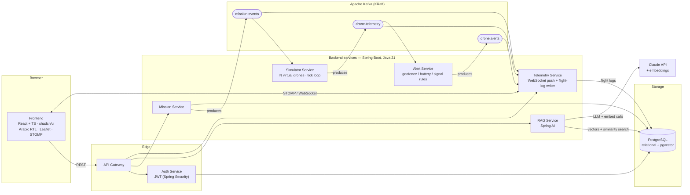
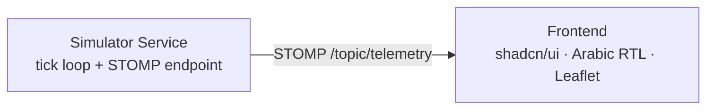

# Sarb (سرب) — Architecture

**Sarb** is a drone fleet operations platform. Arabic, RTL-first UI; English code/APIs/topics. Built incrementally (see the build checklist in `../drone-fleet-platform-brief.md`, Section 17).

## Target architecture (Phase 3+)

The system is event-driven around a single high-volume telemetry stream. The simulator publishes to `drone.telemetry`; multiple independent Kafka consumers each do their own job (WebSocket push, alerting, flight-log persistence) without knowing about each other. **This fan-out is why Kafka is here.**



## Phase 1 shape (the hook, no Kafka yet)

To reach "drones moving on a map" fast, the simulator hosts the WebSocket directly. The telemetry-service split and Kafka fan-out arrive in Phase 3.



## Message shapes

English field names throughout; ISO-8601 timestamps. These are the wire
formats — Phase 1 broadcasts telemetry frames over STOMP as a JSON array of
the shape below (`List<TelemetryFrame>` → `/topic/telemetry`); the alert and
mission shapes below are illustrative ahead of Phases 2–4.

### Telemetry (`drone.telemetry` from Phase 3; broadcast on `/topic/telemetry` since Phase 1)
```json
{
  "droneId": "drone-017",
  "timestamp": "2026-01-15T10:32:04.120Z",
  "position": { "lat": 24.7136, "lon": 46.6753 },
  "altitudeM": 85.4,
  "speedMps": 12.3,
  "headingDeg": 271.0,
  "batteryPct": 62.5,
  "missionId": "mission-4",
  "status": "IN_FLIGHT"
}
```
`status` codes: `IN_FLIGHT`, `IDLE`, `LOW_BATTERY`, `LOST_SIGNAL`, `LANDED`.

### Alert (`drone.alerts`, Phase 2/3)
```json
{
  "alertId": "alert-88",
  "droneId": "drone-017",
  "type": "GEOFENCE_BREACH",
  "severity": "HIGH",
  "timestamp": "2026-01-15T10:32:05.000Z",
  "details": "Drone left permitted operating area"
}
```
`type` codes: `GEOFENCE_BREACH`, `LOW_BATTERY`, `CRITICAL_BATTERY`,
`ALTITUDE_VIOLATION`, `LOST_SIGNAL`.

### Mission (`mission.events`, Phase 4)
```json
{
  "missionId": "mission-4",
  "name": "Perimeter sweep",
  "waypoints": [
    { "lat": 24.71, "lon": 46.67, "altitudeM": 80 },
    { "lat": 24.72, "lon": 46.69, "altitudeM": 80 }
  ],
  "assignedDroneId": "drone-017",
  "status": "IN_PROGRESS"
}
```

## Conventions

- **Package base:** `com.dronefleet.<service>`
- **Config:** Spring `application.properties` (not YAML)
- **Build:** Maven (each service ships its own Maven wrapper — `./mvnw`, no global Maven install required), Java 21, **Spring Boot 4.1.0**.
  > Note: the brief calls for "latest stable Spring Boot 3.x", written before Spring Boot 3.x reached end of life on the public Spring Initializr. As of scaffold time (`start.spring.io` metadata, verified live rather than assumed), only 4.0.x/4.1.x are offered; 4.1.0 is the current stable default. Spring Boot 4 renamed the web starter to `spring-boot-starter-webmvc` (to disambiguate from WebFlux) and introduced per-starter test artifacts (e.g. `spring-boot-starter-webmvc-test`) — both confirmed by generating a throwaway project and running `./mvnw dependency:resolve` against Maven Central before adopting them across all 7 services.
- **Frontend:** Vite + React + TypeScript, Tailwind CSS v4 + **shadcn/ui** (`radix-nova` style, RTL mode enabled via `components.json`), react-leaflet, `@stomp/stompjs` + `sockjs-client`, react-i18next (`ar` bundle), `@fontsource/cairo` (bundled offline, no CDN)
- **Language rule:** all user-facing strings Arabic (RTL); code, API paths, Kafka topic names, JSON field names, and enum codes stay English; frontend maps codes → Arabic labels

### Service ports (to be finalized at scaffold)

| Service | Port |
|---|---|
| gateway | 8080 |
| auth-service | 8081 |
| simulator-service | 8082 |
| telemetry-service | 8083 |
| alert-service | 8084 |
| mission-service | 8085 |
| rag-service | 8086 |
| frontend (dev) | 5173 |

### Kafka topics

- `drone.telemetry` — one message per drone per tick (high volume)
- `drone.alerts` — emitted by the alert engine on a rule violation
- `mission.events` — mission lifecycle (created, assigned, started, completed, aborted)
