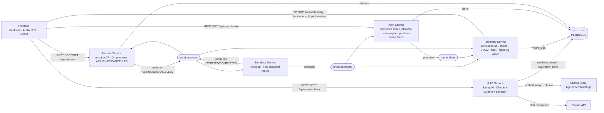

# Sarb (سرب) — Architecture

**Sarb** is a drone fleet operations platform. Arabic, RTL-first UI; English code/APIs/topics. Built incrementally (see the build checklist in `../drone-fleet-platform-brief.md`, Section 17).

## Target architecture (Phase 3+)

The system is event-driven around a single high-volume telemetry stream. The simulator publishes to `drone.telemetry`; multiple independent Kafka consumers each do their own job (WebSocket push, alerting, flight-log persistence) without knowing about each other. **This fan-out is why Kafka is here.**


## Current shape (Phase 5 — the RAG assistant is real)

`simulator-service` is a Kafka producer of `drone.telemetry` (one message per drone per tick, keyed by `droneId`) and, since Phase 4, also a consumer/producer on `mission.events`. `telemetry-service` and `alert-service` are independent consumers of `drone.telemetry` - neither knows the other exists. `alert-service` produces `drone.alerts`, which `telemetry-service` also consumes and relays onto the WebSocket the frontend already holds. `mission-service` owns mission CRUD (Postgres) and publishes `ASSIGNED`/`CANCELLED` lifecycle events; `simulator-service` is the only party that knows when a drone actually starts/finishes flying a route, so it publishes `STARTED`/`COMPLETED` back onto the same topic, and `mission-service` consumes its own topic to keep mission rows in sync. `telemetry-service` also relays `mission.events` onto the WebSocket for live mission status in the UI. `rag-service` sits outside the Kafka fan-out entirely - it's a plain REST service (no topic involvement) that answers regulation/SOP questions via retrieval-augmented generation against pgvector, called directly by the frontend. Gateway/auth (and the REST proxying they'd give the frontend) are still Phase 6 - until then the frontend talks to `telemetry-service` (WebSocket), `alert-service`, `mission-service`, and `rag-service` (REST) directly.



> Note: `simulator-service`, `telemetry-service`, `alert-service`, and `mission-service` each carry their own copy of the wire-shape classes they need (`TelemetryFrame`/`Position`/`DroneStatus`, `AlertDto`/`AlertType`/`AlertSeverity`, `MissionEventDto`/`WaypointDto`/`MissionEventType`) rather than sharing a library module - each service stays independently deployable, at the cost of manually keeping the mirrored shapes in sync. Kafka JSON (de)serialization: producers set `spring.json.add.type.headers=false` so they don't stamp messages with a class name from their own package; each `@KafkaListener` instead pins `spring.json.value.default.type` to its own local class. `rag-service` doesn't participate in this at all - no Kafka dependency, no mirrored DTOs, just REST in and REST out.

## Message shapes

English field names throughout; ISO-8601 timestamps. These are the wire
formats, as actually implemented as of Phase 5.

### Telemetry (`drone.telemetry` from Phase 3; broadcast on `/topic/telemetry` since Phase 1)
```json
{
  "droneId": "drone-017",
  "timestamp": "2026-01-15T10:32:04.120Z",
  "position": { "lat": 24.7136, "lon": 46.6753 },
  "altitudeM": 85.4,
  "speedMps": 12.3,
  "headingDeg": 271.0,
  "batteryPct": 62.5,
  "missionId": "mission-4",
  "status": "IN_FLIGHT"
}
```
`status` codes: `IN_FLIGHT`, `IDLE`, `LOW_BATTERY`, `LOST_SIGNAL`, `LANDED`.

### Alert (`drone.alerts`, produced by alert-service since Phase 3)
```json
{
  "alertId": 88,
  "droneId": "drone-017",
  "type": "GEOFENCE_BREACH",
  "severity": "HIGH",
  "message": "Drone drone-017 left the permitted operating area",
  "triggeredAt": "2026-01-15T10:32:05.000Z",
  "resolvedAt": null
}
```
`resolvedAt == null` means the alert is still active. `type` codes: `GEOFENCE_BREACH`, `LOW_BATTERY`, `CRITICAL_BATTERY`,
`ALTITUDE_VIOLATION`, `LOST_SIGNAL`.

### Mission event (`mission.events`, produced by mission-service and simulator-service since Phase 4)
```json
{
  "missionId": 4,
  "droneId": "drone-017",
  "type": "ASSIGNED",
  "waypoints": [
    { "lat": 24.71, "lon": 46.67, "altitudeM": 80 },
    { "lat": 24.72, "lon": 46.69, "altitudeM": 80 }
  ],
  "timestamp": "2026-01-15T10:32:04.120Z"
}
```
`type` codes: `ASSIGNED`, `CANCELLED` (published by mission-service, the system of record); `STARTED`, `COMPLETED` (published back by simulator-service, the only party that knows when a drone actually starts/finishes a route). `waypoints` is only populated on `ASSIGNED`. This is a lifecycle event, not the full mission record - `GET /api/missions` on mission-service returns the full `MissionDto` (adds `status`, `createdAt`, `startedAt`, `completedAt`).

### Assistant Q&A (`POST /api/assistant/ask` on rag-service, REST only - no Kafka topic)
Request:
```json
{ "question": "ما هو الحد الأقصى للارتفاع المسموح به لطيران الطائرة المسيرة؟" }
```
Response:
```json
{
  "answer": "الحد الأقصى للارتفاع...",
  "citations": [
    { "source": "gacar-part-107.pdf", "sourceType": "regulation", "page": 18, "score": 0.56, "excerpt": "..." },
    { "source": "sop-ops-001-flight-operations.txt", "sourceType": "sop", "page": null, "score": 0.69, "excerpt": "..." }
  ]
}
```
`sourceType` codes: `regulation` (GACAR Part 107 PDF, English source text), `sop` (the two self-written Arabic SOP docs). `page` is only populated for PDF-sourced chunks. The corpus is genuinely bilingual - GACAR Part 107 is only published in English by GACA, so retrieval is cross-lingual (Arabic question → `bge-m3` multilingual embeddings → matches against both English and Arabic chunks) and the answer is always generated in Arabic regardless of which language the matched chunk was in, citing the exact source section.

## Conventions

- **Package base:** `com.dronefleet.<service>`
- **Config:** Spring `application.properties` (not YAML)
- **Build:** Maven (each service ships its own Maven wrapper — `./mvnw`, no global Maven install required), Java 21, **Spring Boot 4.1.0**.
  > Note: the brief calls for "latest stable Spring Boot 3.x", written before Spring Boot 3.x reached end of life on the public Spring Initializr. As of scaffold time (`start.spring.io` metadata, verified live rather than assumed), only 4.0.x/4.1.x are offered; 4.1.0 is the current stable default. Spring Boot 4 renamed the web starter to `spring-boot-starter-webmvc` (to disambiguate from WebFlux) and introduced per-starter test artifacts (e.g. `spring-boot-starter-webmvc-test`) — both confirmed by generating a throwaway project and running `./mvnw dependency:resolve` against Maven Central before adopting them across all 7 services.
- **Frontend:** Vite + React + TypeScript, Tailwind CSS v4 + **shadcn/ui** (`radix-nova` style, RTL mode enabled via `components.json`), react-leaflet, `@stomp/stompjs` + `sockjs-client`, react-i18next (`ar` bundle), `@fontsource/cairo` (bundled offline, no CDN)
- **Language rule:** all user-facing strings Arabic (RTL); code, API paths, Kafka topic names, JSON field names, and enum codes stay English; frontend maps codes → Arabic labels

### Service ports

| Service | Port |
|---|---|
| gateway | 8080 |
| auth-service | 8081 |
| simulator-service | 8082 |
| telemetry-service | 8083 |
| alert-service | 8084 |
| mission-service | 8085 |
| rag-service | 8086 |
| frontend (dev) | 5173 |

### Kafka topics

- `drone.telemetry` — one message per drone per tick (high volume)
- `drone.alerts` — emitted by the alert engine on a rule violation
- `mission.events` — mission lifecycle: `ASSIGNED`/`CANCELLED` (mission-service) and `STARTED`/`COMPLETED` (simulator-service)

> `rag-service` is not on Kafka at all - it's a self-contained REST service (`POST /api/assistant/ask`) with its own local dependency, **Ollama** (`brew install ollama`, model `bge-m3`, `localhost:11434`), used only for embeddings. Chat completion goes to the real Claude API. Both are configured in `rag-service/application.properties`; the Anthropic key is loaded from a gitignored `rag-service/.env` (see `.env.example`) via a small first-party `EnvironmentPostProcessor` - not a Kafka/Postgres-schema concern like the other services, called out here because it's the one service with an external secret dependency.
